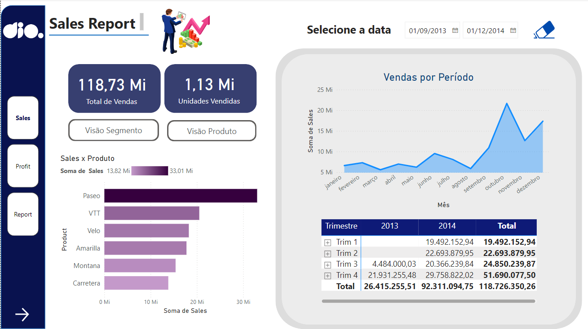
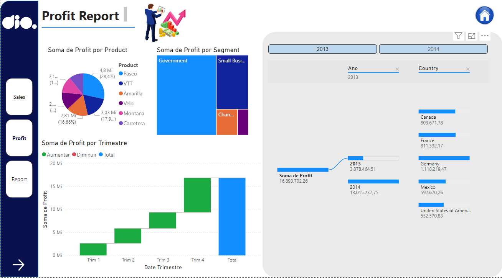
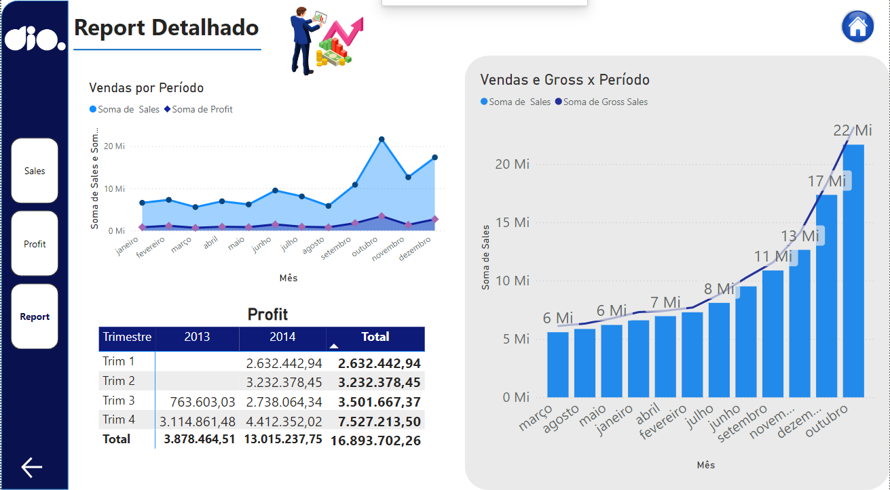

<h1>
    
      Sysvision - Data Analytics com Power BI

</h1>

# :computer: Desafio de projeto: Criando um Dashboard Gerencial para Tomada de Decisões Com Power BI

## Objetivo do desafio:

Modificar o relatório criativo, o primeiro que criamos juntos, focando na experiência do usuário. Acompanhe o vídeo para que você entenda o que foi feito neste processo. Além disso, leve em consideração os seguintes pontos: 

- Posicionamento
- Contraste
- Proporção áurea
- Segmentação dos dados

Como comentamos no curso, não é uma regra rígida. Entenda os pontos e crie seu relatório levando-os em consideração. Contudo, saiba quando você deve quebrar as regras. Isso vai trazer mais criatividade ao seu relatório. Esses pontos fora da curva deixam seu relatório mais interessante.

Próximos passos:

- Insira os botões de navegabilidade
- Modifique a segunda página de forma similar a demostrada no desafio para a primeira página
- Modifique os botões de navegabilidade a fim de destacar o focalizar e selecionar
- Criar os menus de navegabilidade em cada página
- O estilo dos botões é livre!
- O relatório é composto por 3 páginas

# :bulb: Solução do desafio 

O relatório encontra-se no arquivo *Relatrio_Sales_Profit_financial* segue o print das páginas:

