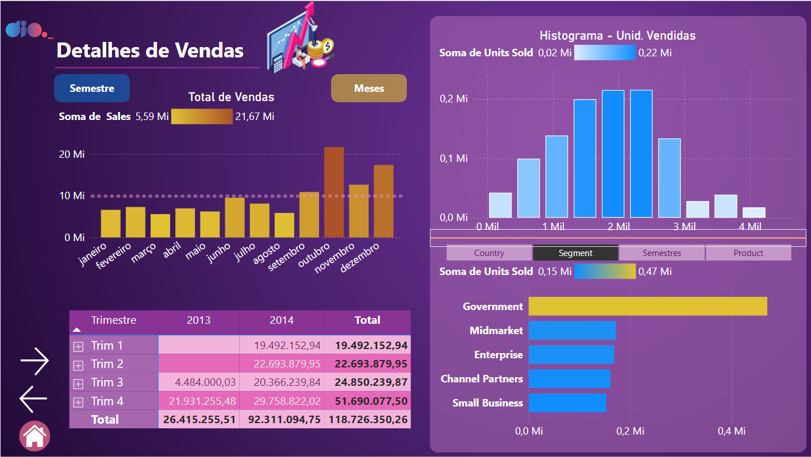
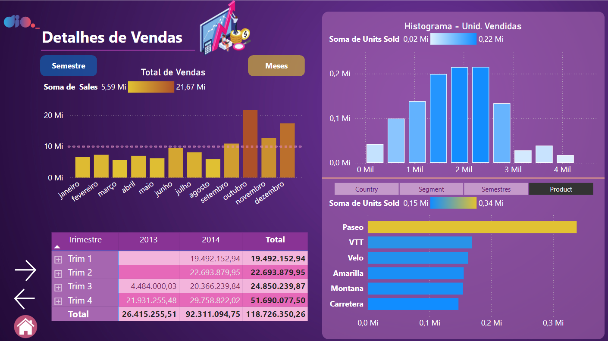
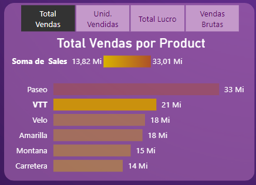
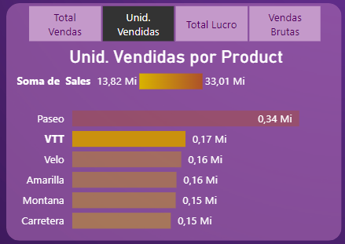

<h1>
    <a href="https://www.dio.me/">
     </a>
    <span>  Sysvision - Data Analytics com Power BI
</span>
</h1>

# :computer: Desafio de projeto: Criando Relatórios Dinâmicos com o uso de Parâmetros no Power BI

## Objetivo do desafio:

Agora você vai utilizar o relatório do desafio do módulo anterior. Com esse contexto em mãos você irá criar pelo menos dois visuais considerando a criação de parâmetros.

Siga os mesmos passos que fizemos durante o curso para criar os parâmetros de campos. Sendo assim, as diretrizes são:

- Primeira visão: parâmetro com base em categorias
- Segunda visão: parâmetros com base em valores (profit, sales, ou outros)

Sigam a mesma estilização do relatório
Criem uma história para apresentar essa visão sobre os dados

# :bulb: Solução do desafio 

Utilizei o [relatório Vendas e Lucros](https://github.com/tsdes-santiago/DIOdataAnalytics/tree/main/RelatorioVendasLucros) e modifiquei o página **Detalhes** para mostrar o histograma de Unidades vendidas por parâmetros:

- Country 
- Segmento 
- Semestres
- Product

Seguem os exemplos de seleção **segment** e **product**






Na página **Principal** modifiquei o histograma usando medidas como parâmetros:

- Total Vendas

- Unid. Vendidas 

- Total lucro
    ```
    Total Lucro = SUMX(financials, financials[Profit]) 
    ```

- Vendas Brutas
    ```
    Vendas Brutas = SUMX(financials, financials[Gross Sales])
    ```

Segue os exemplos de seleção para **Total Vendas** e **Unid. Vendidas**

<p float="left">


</p>

O relatório encontra-se no arquivo **sales_report.pbix**