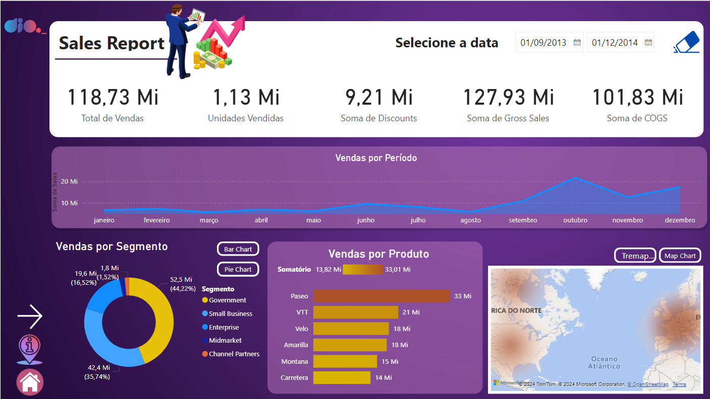
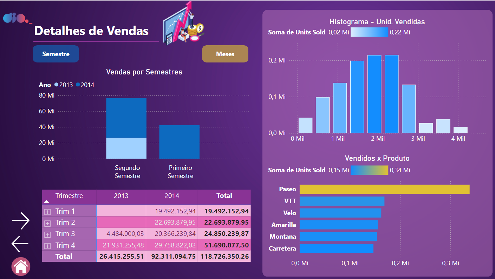
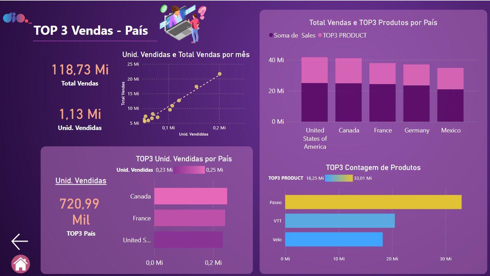

<h1>
    <a href="https://www.dio.me/">
     </a>
    <span>  Sysvision - Data Analytics com Power BI
</span>
</h1>

# :computer: Desafio de projeto: Criando um Relatório Vendas e Lucros com Data Analytics com Power BI

## Objetivo do desafio:

Pontos a serem considerados

- Crie a página detalhes conforme mostrado no desafio de projeto
- Pense na disposição dos visuais em como o cliente irá consumir o conteúdo
- Dependendo da disposição dos visuais o número de páginas pode variar. Até duas páginas podem compor o que é pedido
- Crie as medidas necessárias

Visuais que podem compor o relatório:

- Visuais sobre os TOP3 Produtos
- Principais países em termos de vendas e/ou profit (ou outro campo)
- Gráfico de dispersão sobre Unidades vendidas e Vendas por mês
- Visuais de agrupamentos de dados
- Visuais de compartimentação dos dados

# :bulb: Solução do desafio 

A relatório foi desenvolvido seguindo as instruções, a página detalhes feita e Top 3 feitas do zero.







Para descrever a contagem de unidades vendidas por top 3 países criei a medida:

```
TOP3 País = CALCULATE(
    [Unid. Vendidas],
    TOPN(
        3, 
        ALL(financials[Country]),
        [Unid. Vendidas]), 
    VALUES(financials[Country])
    )
```

O relatório encontra-se no arquivo **sales_report_desafio_projeto.pbix**