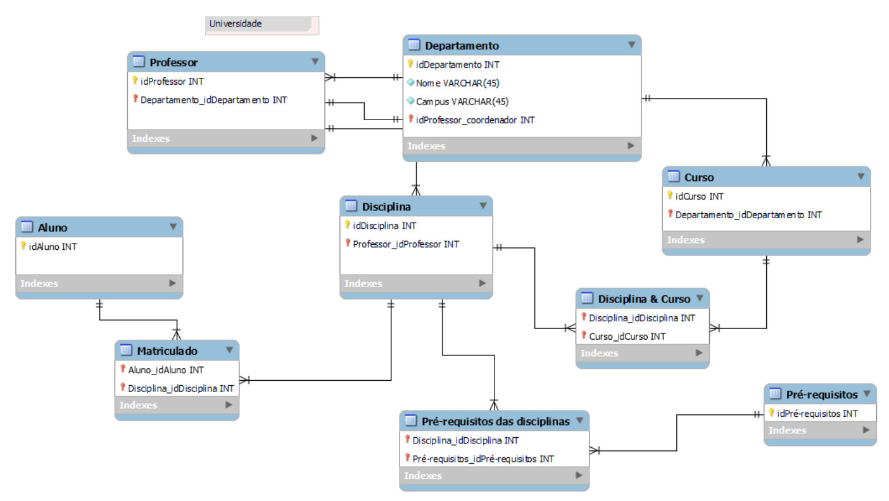
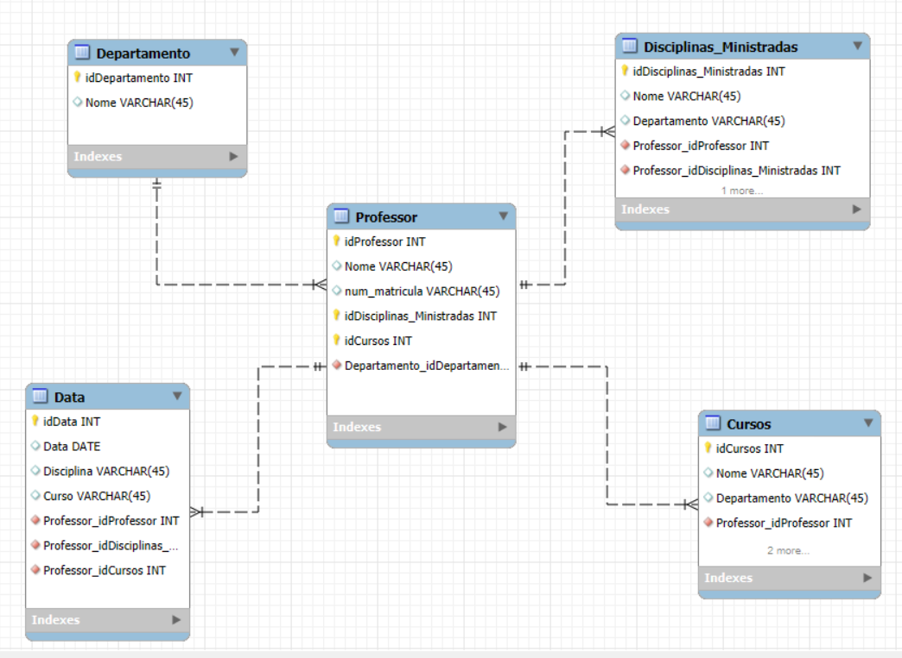

<h1>
    
      Sysvision - Data Analytics com Power BI

</h1>

# :computer: Desafio de projeto: Dashboard utilizando Star Schema

## Instruções de Entrega do Desafio

Criar o diagrama dimensional – star schema – com base no diagrama relacional disponibilizado.

* Foco:

- Professor – objeto de análise

Vocês irão montar o esquema em estrela com o foco na análise dos dados dos professores. Sendo assim, a tabela fato deve refletir diversos dados sobre professor, cursos ministrados, departamento ao qual faz parte.... Por aí vocês já têm uma ideia do que deve compor a tabela fato do modelo em questão.

Obs.: Não é necessário refletir dados sobre os alunos!

* O que deve ser feito?

- Deverá ser criada a tabela Fato que contêm o contexto analisado. Da mesma forma, é necessária a criação das tabelas dimensão que serão compostas pelos detalhes relacionados ao contexto.

- Por fim, mas não menos importante, adicione uma tabela dimensão de datas. 
Para compensar a falta de dados de datas do modelo relacional, suponha que você tem acesso aos dados e crie os campos necessários para modelagem.

Ex: data de oferta das disciplinas, data de oferta dos cursos, entre outros. O formato, ou melhor, a granularidade, não está fixada. Podem ser utilizados diferentes formatos que correspondem a diferentes níveis de granularidade.

Imagem de referência

 

# :bulb: Solução do desafio 

Diagrama dimensional star schema foi feito utilizando o MySQL Workbench e encontra-se no arquivo **starSchema**.

## Considerações para relacionamentos

* n -- 1

    - Um professor é associado a somente um departamento, mas um departamento pode ter vários professores

* 1 -- n

    - Um professor pode ministrar várias disciplinas, mas cada disciplina é associada a um professor

    - Cada disciplina está associada a um curso, um professor pode ministrar disciplinas para diferentes cursos

    - Cada disciplina é oferecida em um semestre, o professor pode ministrar várias disciplinas em vários semestres, mas cada data é associada a uma disciplina e um professor.