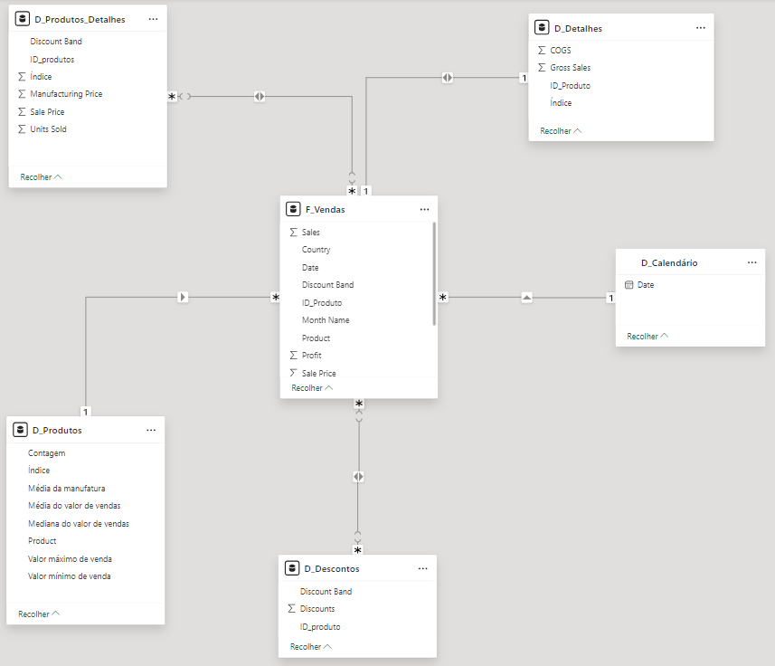

<h1>
    <a href="https://www.dio.me/">
     </a>
    <span>  Sysvision - Data Analytics com Power BI
</span>
</h1>

# :computer: Desafio de projeto: Modelando um Dashboard de E-commerce com Power BI Utilizando Fórmulas DAX

## Instruções de Entrega do Desafio

Utilizaremos a tabela única de Financial Sample para criar as tabelas dimensão e fato do nosso 
modelo baseado em star schema. 
O processo consiste na criação das tabelas com base na tabela original. A partir da cópia serão 
selecionadas as colunas que irão compor a visão da nova tabela. 

As instruções detalhadas encontram-se no arquivo PDF **Descrição do Desafio - Modelagem e Transformação de dados com DAX com Power BI**

Foi utilizado como base o [github da instrutora](https://github.com/julianazanelatto/power_bi_analyst/tree/main/M%C3%B3dulo%204/Desafios%20de%20Projeto).

# :bulb: Solução do desafio 

* D_Produtos_Detalhes
    
    * Foi adicionada a coluna ID_produto utilizando **Adicionar Coluna Condicional** e a coluna **Produto** removida

* D_Detalhes

    * Adicionadas as colunas:
        * **Índice** : se relaciona com SK_ID de F_Vendas
        * **ID_produto**

    * Mantidas as colunas que não estão em outras tabelas dimensão 
        
        * **Gross Sales**
        * **COGS**

* D_Calendário
    * Tabela criada com a funçâo:
    
    ```
    D_Calendário = CALENDAR(MINX (F_Vendas, [Date]), MAXX (F_Vendas, [Date]))
    ```

As relações entre tabelas foram adicionadas:

